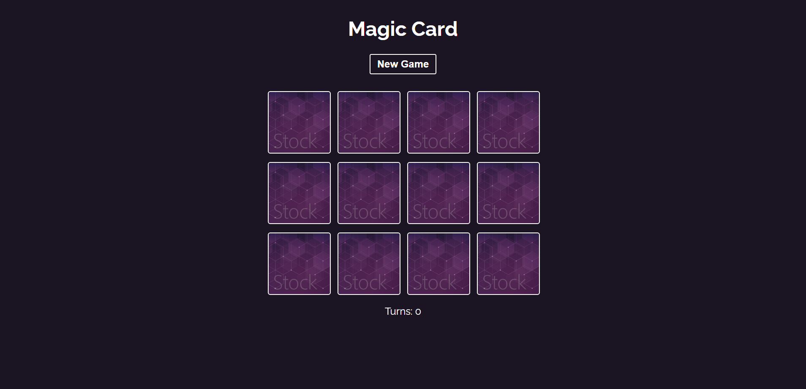
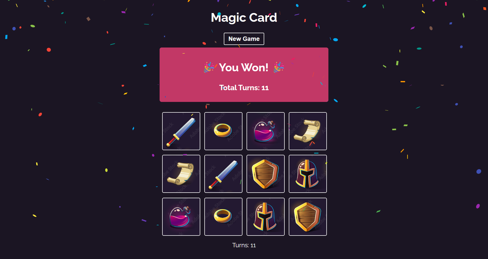

# 🃏 Magic Memory Card Game

A modern and interactive Memory Card Matching Game built with **React**.  
Match all the cards with the least number of turns and win the game! 🎉

---

## 🚀 Live Demo
(Add your live link here after deployment)

---

## 📸 Preview

### 🃏 Game Board
![Game Board]
 
 
### 🎉 Win Screen
![Win Screen]

---

## ✨ Features

- 🔀 Random card shuffle every game
- 🎯 Turn counter
- 🧠 Smart card matching logic
- 🚫 Disabled clicks while checking match
- 🎉 Win detection
- 🎊 Confetti celebration effect
- 🔄 New Game reset button

---

## 🛠️ Built With

- React (Functional Components)
- React Hooks (`useState`, `useEffect`)
- JavaScript (ES6)
- CSS3
- react-confetti

---

## 📂 Project Structure
